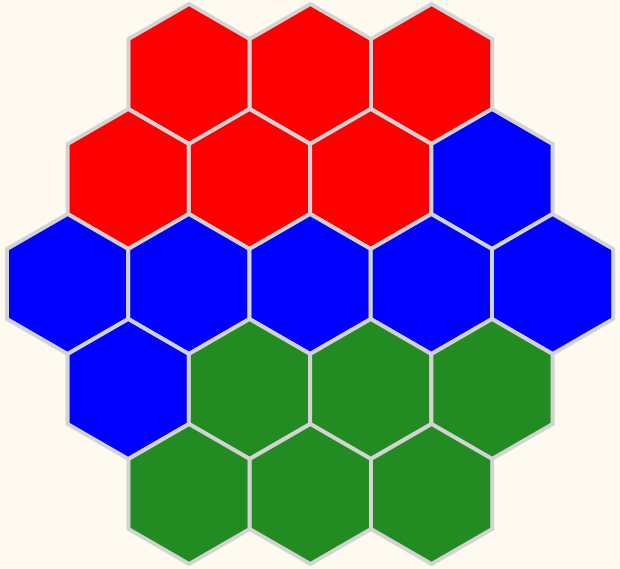

[](https://classroom.github.com/a/XbZw8B6J)
# hexagon-puzzle

A puzzle centered around the arrangement of hexagonal elements.

## General description

This is a maven project which forms a simple puzzle game using javafx.
The puzzle consists of 19 hexagonal tiles, 6 of them are red coloured, 6 green and 7 blue. These tiles are
arraged so that they form a bigger hexagon. 
Below is an image showing how, by default, the hexagons and their colours are arranged.



The goal of the puzzle is to arrange these elements in such a way, that all blue hexagons have six neighbours (example shown below).
The player can change the state of the puzzle by choosing a tile that has six neighbours (tiles fully contained by other tiles),
and choosing a direction, either clockwise or counter-clockwise, to rotate the neighbours around the selected tile in.


## Gameplay

On initial startup, the player is prompted to specify themselves an alias to go by. This is not necessary and the field 
can be left blank, however the project uses these aliases to keep track of records the player sets.

After this the game begins. The player may choose any internal tile by clicking on it, and may dismiss the current selection,
by either choosing a different tile, or pressing ESC.

Making a move can be done by choosing a tile, and a direction to rotate the tile's neighbours in;
the player may press either D or RIGHT-ARROW for clockwise rotation,
or A or LEFT-ARROW for counter-clockwise rotation.

Upon completing the puzzle the game displays the top ten previous records set, based on the number of moves it took to solve the puzzle.

### One potential solution to the puzzle

The following steps (N1 N2 N3) are to be read as: (N1 - hexagon's row number, N2 - hexagon's collumn number,
N3 - direction of rotation 1 - clockwise,-1 - counter-clockwise)

SOLUTION:<br>
 3 3 -1 <br>
 4 2 1 <br>
 3 3 1<br>
 3 4 -1<br>
 3 4 -1<br>
 3 1 1<br>
 3 1 1<br>
 3 3 1<br>
 3 3 1<br>
 3 3 1<br>
 3 1 -1<br>
 3 1 -1<br>

## Requirements

Building the project requires JDK 21 or later.

Building the project also requires access to the [GitHub Packages](https://docs.github.com/en/packages) service.
Accessing the GitHub Packages service requires authentication using a personal access token (classic) that can be created [here](https://github.com/settings/tokens).

> [!IMPORTANT]
> You must create a personal access token (PAT) with the `read:packages` scope.

Finally, you need a `settings.xml` file with the following content to store your PAT:

```xml
<settings xmlns="http://maven.apache.org/SETTINGS/1.0.0"
          xmlns:xsi="http://www.w3.org/2001/XMLSchema-instance"
          xsi:schemaLocation="http://maven.apache.org/SETTINGS/1.0.0 http://maven.apache.org/xsd/settings-1.0.0.xsd">
    <servers>
        <server>
            <id>github</id>
            <username><!-- Your GitHub username --></username>
            <password><!-- Your GitHub personal access token (classic) --></password>
        </server>
    </servers>
</settings>
```

The `settings.xml` file must be placed in the `.m2` directory in your home directory, i.e.,
in the same directory that stores your local Maven repository.


